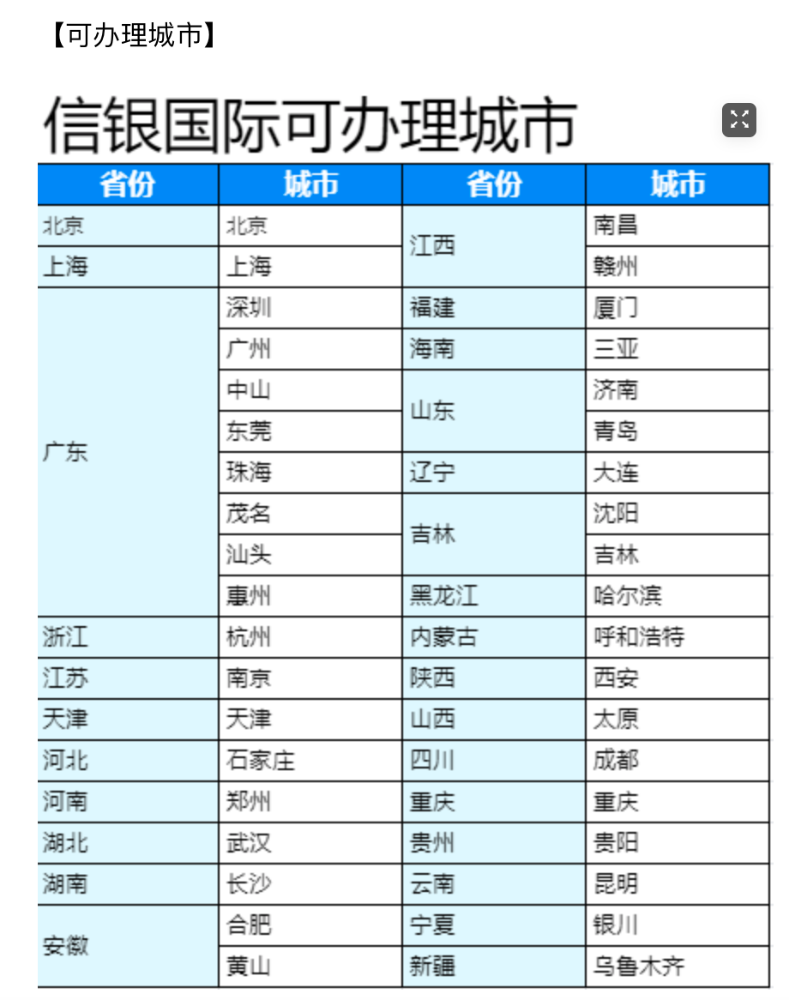

#! https://zhuanlan.zhihu.com/p/350351566
# [中信]信银国际香港卡开户分享

一、**开户准备资料**

1. 身份证原件
2. 境内中信卡+中信银行储蓄卡的最近三个月流水打印件*3份。**（其中一份彩印作为原件，新开户只需发生一笔交易都可以，电子账单在手机银行即可下载，流程见文件最后附件）**
3. 律师见证费500元

**4. 香港账户激活后30天内存入1万港币**

## 若身份证地址为集体地址&没有精确到门牌号地址

* 需提供：**住宅地址证明原件1份及复印件2份**资料如：最近三个月内发出的水电煤费单/非集体地址信用卡账单/非集体户口本户主页+本人页。

* **若身份证上的地址为集体户口地址或者没有精确到房号需要提供该项。资料如：最近三个月内发出的水电煤费单/非集体地址信用卡账单/非集体户口本户主页+本人页。若身份证地址不是集体户口的，请忽略此项。**

## 办理周期

一般3-4周，最近疫情可能延迟

【预约格式】

第一步：开通富途证券账户

准备身份证和任意银行卡号点击链接开户：https://j.futunn.com/0024ri 

第二步：准备办香港卡材料，

第三步：联系微信：`505412642` 备注: `中信`

单个公司满**20**人就可安排银行上门办卡。

## 常见Q&A

**Q1.我还没有中信银行境内的储蓄卡，是否需要提前自行办理？**

A1.是的。

**Q2.信银国际账户管理费一直免费吗？**

A2.至今还是免费，若日后有调整，以香港分行调整后收费标准为准。

**Q3.护照或港澳通行证没有签注或者签注过期怎么办？**

A3.护照和港澳通行证只要有效期内即可，无需签注，签注过期也完全没有问题！

**Q4.我的亲戚好友也想开立这个国际账户，可以顺便一起办理么？**

A4.开通富途证券账户即可,准备身份证和任意银行卡号点击链接开户：https://j.futunn.com/0024ri 

**Q5.我的身份证地址是非集体地址并且精确到门牌号，住宅证明怎么提供？**

A5.如果您的身份证上地址是非集体地址并且精确到门牌号，无论您的户口实际上是否集体户口，都无需提供额外证明文件，您可以不用考虑这个问题啦！

**Q6.如果我的身份证上地址是集体地址，但是户口是非集体户口，住宅证明怎么提供？**

A6.可以提供户口本（户主页+本人页）复印件、最近三个月信用卡账单原件（非公司地址，必须是个人住宅地址并且精确到门牌号，电子账单有电子章的彩色打印）/最近三个月水电煤缴费单（上面有您的名字+住宅地址并且精确到门牌号+电子章，彩色打印）等

**Q7.如果我的身份证上地址是集体地址，户口为集体户口，住宅证明怎么提供？**

A7.如果您的身份证上地址是集体地址，户口也是集体地址，可以选择提供最近三个月信用卡账单原件（非公司地址，必须是个人住宅地址并且精确到门牌号，电子账单有电子章的彩色打印）/最近三个月水电煤缴费单（上面有您的名字+住宅地址并且精确到门牌号+电子章，彩色打印）等

**Q8.转入富途证券账户流程及费用？**

A8.通过信银国际账户网上银行的即时结算系统即可转，建议选用香港富途证券账户（富途在香港美国都有对公账户），选用港币交易可以免手续费，若选用美金交易每笔手续费2-8美金。

**Q9.富途证券转入信银国际账户流程及费用？**

A9，免费。

## 可办理城市

