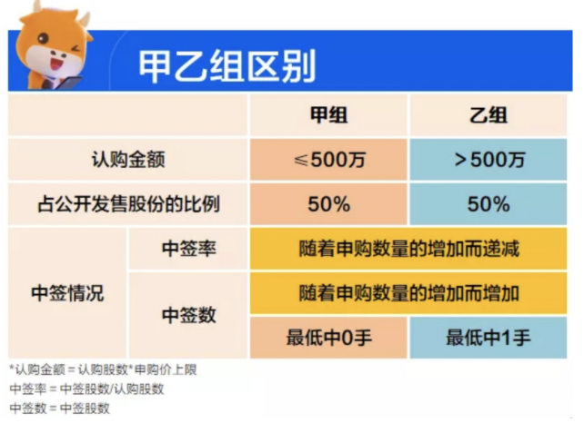

#! https://zhuanlan.zhihu.com/p/352226570
# [打新]港股打新|甲组已组傻傻分不清

港股打新一般就是打公开发售的配额。其中公开发售分为两个组，港股公开的10%份额，平均分配给甲乙组：

* 甲组就是正常认购的组，散户你几手我几手的认购，而且甲组里面偏袒散户认购，**优先一人一手**，这也是港股打新中签率远高于A股的主要原因；

* 乙组是需要达到一个标准才能进入，至少是认购500万以上才能进入乙组，这个组的中签率会提升很多，超过500W的人都能分到很多货。

举个例子，某新股的公开认购额有2亿股，那么则有1亿股被分至甲组，而余下的1亿股会被分至乙组。除非任意一组的认购额不足，否则这个分配比例基本保持1：1不变。

甲尾、乙头、乙尾又是什么意思呢？

* 甲头就是甲组第一档，也叫做一手中签率。

* 甲尾是甲组最后一档，正常需要融资认购资金达400多万以上，因为下一档就是500多万的乙头了。

* 乙头就是乙组的第一档，一般乙头性价比是最高的，正常需要融资认购资金达500多万以上。

* 乙尾也就是我们常说的顶头锤，一般需要融资几千万甚至几个亿

**民间盛行传言，乙组中签率会比甲组高得多，实际上这个说法是不太准确的。**

通常来说，各大券商平台对比甲乙组的中签率，指的是实际中签率，即中签股数占认购股数的比例，在一般情况下，`认购股数越多，分母越大，中签比例反而会因此降低`。

但就中签概率而言，当然是申的越多「中奖」概率越大，这时乙组大户们还是有很大优势的。对于申购乙组的大户来说，有最低中一手的保证，而甲组的散户们却可能颗粒无收。

当然，不是所有新股的发行都会分甲乙组。当公司发行市值低于4亿港元时，通常是不具有划分甲乙组的能力的；或某新股只获得极少的集资额，可能也无甲、乙组之分。

**资金该如何分配才能保证最大利益？**

* 50万以下，就专做甲组就完事儿了。

* 50万-300万，大甲组+乙头。

* 300万-1000万，乙组。

`总之优势新股，资金足够，干乙组，必中1手，资金紧张，多账户做甲组，稳当！！！`

**【限时福利】开户获取 800港币 + 200(50*4次)打新券**

* 富途开户，手机打开：https://j.futunn.com/0024ri  工作单位统一写【百度】二字，确认邀请人为: 17166820  
* 开户好加我领取奖励

* 微信：505412642 备注知乎甲组