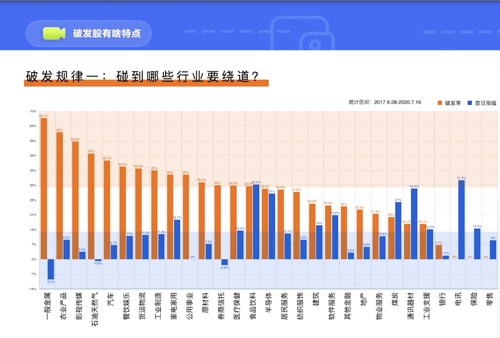
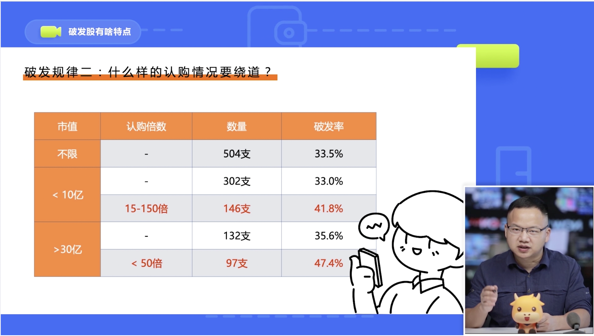

#! https://zhuanlan.zhihu.com/p/346616015

# 【港股】破发股有什么特点

可以从新股的所在行业和认购倍数上去分析破发股的一些规律

`认购倍数`：比如一只新股的融资额是10个亿，如果有1000亿的资金去认购它，那认购倍数就是100倍

如果新股所在的行业的市场表现比平均水平还要差，那我们就要绕开它

`橙色柱子`：行业平均破发率

`蓝色柱子`：行业平均涨幅

`破发率高于均值`: 落在浅橙色底色区域，对于这些行业还是绕开比较好，比如说一般金属、农业产品、影视传媒、石油天然气破发率远远高于市场平均破发率

`平均涨幅低于均值`：落在浅蓝色底色区域，比如券商信托、银行。也是绕开比较好

第一种：`10亿市值`以下，认购倍数在`15-150倍`,破发率达到 `41.8%`

第二种：`30亿市值`以上，认购倍数小于50倍，破法律达到 `47.4%`

这两类新股一定要警惕，如果恰好还处于破发率较高的行业，就最好就敬而远之了

