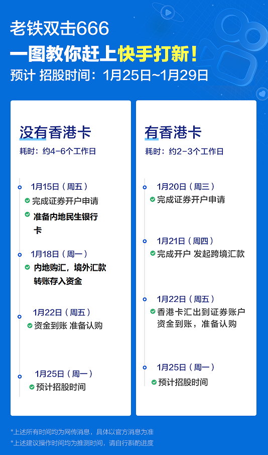

#! https://zhuanlan.zhihu.com/p/345536492
# 快手打新分享

建议存入2700美金或者2w港币以上，这样大多数的新股都可以至少打1手

参与港股打新，最低要存入至少能认购1手的港币，不同港股股票每手的数量不一样，多数为1手100股，有的一手200股，500股，1000股或者更多。

港股大多1手价格在5千到2万港币之间

打新金额没有上限，打新的越多，中签的数量可能就越多。如果想多存一些也是可以的

第一步：开通富途股票账户
专场急速开户链接：https://j.futunn.com/0024ri
提交资料，仅需要本人身份证照片和内地银行卡卡号即可 公司写(百度)

快手最快将于下周二（26日）招股，拟发行4.159亿股，招股价上限约93港元，每手50股，一手入场费4650港元。