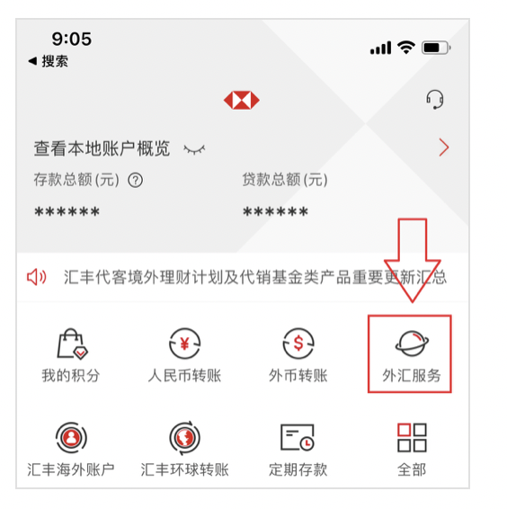
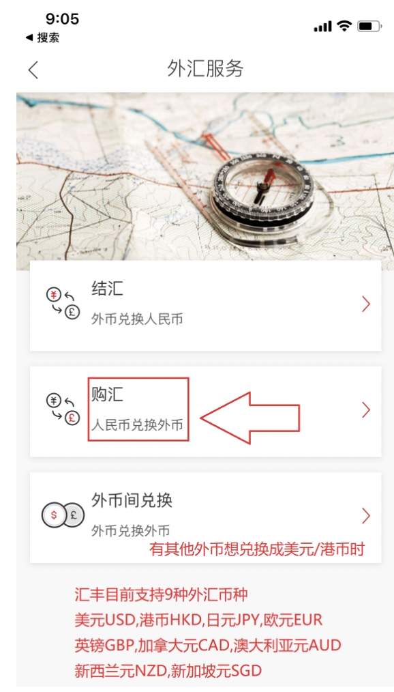
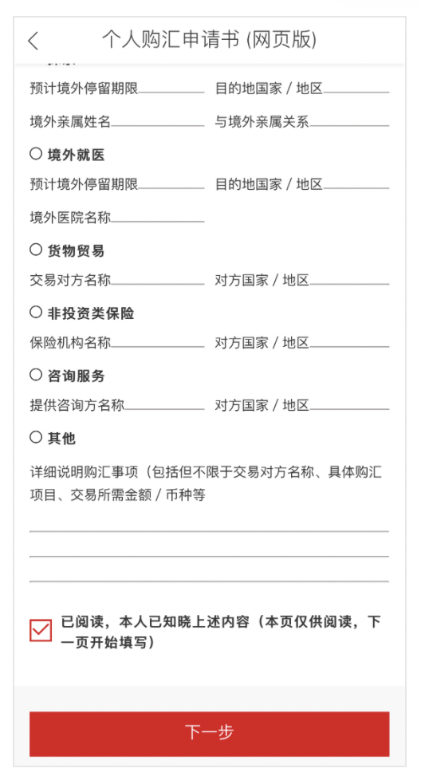
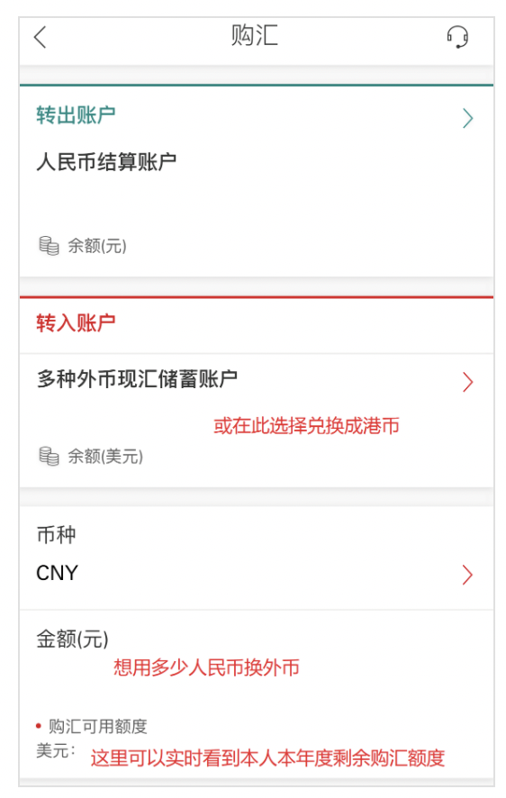
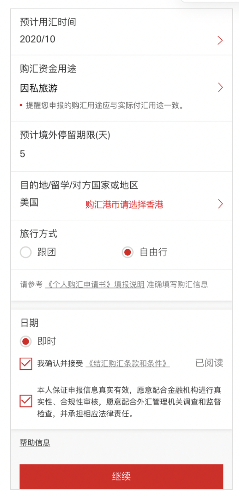
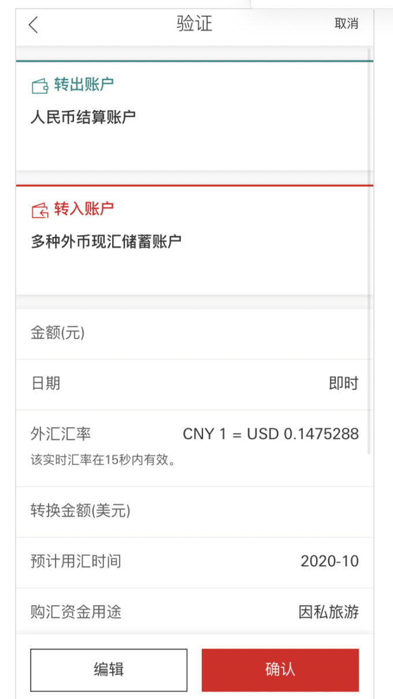
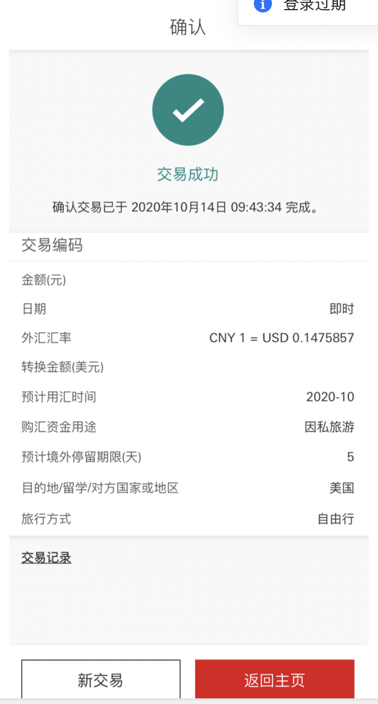

#! https://zhuanlan.zhihu.com/p/345327618

# 汇丰内地卡转汇丰香港卡流程分享

### **注意事项**

1、人民币不能直接转出境，需在境内换汇成外币后再转出境（如美元USD，港币HKD）

2、换汇原因旅游即可，不可涉及资本项目下原因

3、汇丰中国目前支持9种外汇币种：美元USD，港币HKD，日元JPY，欧元EUR，

英镑GBP，加拿大元CAD，澳大利亚元AUD，新西兰元NZD，新加坡元SGD

4、汇丰中国电子渠道（网上银行/手机银行/微信服务号）**结售汇时间工作日9：30至下午6点**

**整理的流程是：**

### **第一步，汇丰中国：人民币→美元/港币**

1. 首先打开汇丰中国app，登录后选择外汇服务

2. 选择用人民币换外币时，直接点购汇（外管局规定，每人每年50,000美元购汇额度）

3. 等待30秒倒计时结束后 可点击 **下一步**

4. 除图式方法兑换外币，还有一种方法是将币种直接选择外币，然后在金额的位置填写想获得多少外币

5. 验证界面 请确认一下汇率是否接受，无误的话请点击确认。

6. 至此在汇丰中国换汇完成

有问题可以微信：505412642 备注:知乎