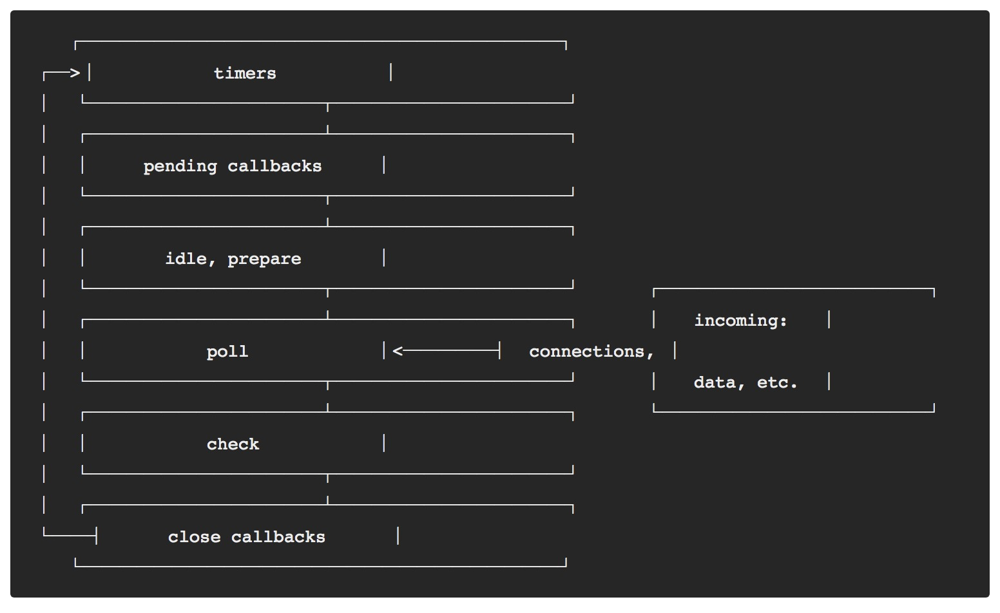

# Node.Js事件循环

文章首发于我的[Github](https://github.com/lvgithub/blog)
## 事件循环是什么



首先让我们看看事件循环是如何设计的，做了什么，才能更好的理解它。上图([来源Node官网](https://nodejs.org/en/docs/guides/event-loop-timers-and-nexttick/))解释了事件循环的6个阶段及执行顺序。下面我们开始探索各阶段都做了什么？

* timers: 此阶段执行由setTimeout()和setInterval()注册的callback。
* pending callbacks: 此阶段执行某些系统操作（如TCP错误类型）的回调。例如，如果尝试连接时TCP套接字收到ECONNREFUSED，则错误回调在这个阶段执行。
* idle, prepare: 只在内部使用（忽略）
* pool:  检索新的IO事件,执行相关IO的callback,node会在适当的时候阻塞。
* check: 此阶段执行由setImmediate() 注册的callbacks 
* close callbacks: 该阶段执行close 类型的callback,比如 socket.on('close', ...)。

每个阶段执行自己独立的FIFO队列里面注册的callback。每种类型的回调会注册到各自的阶段中。

简单的说：JS 代码中的回调最终会到event loop 中注册为事件，event loop 把任务分配给 OS | thread pool (现在操作系统都提供的异步的接口，会优先选择此选项),最后 event loop 轮询OS任务完成的事件，取出结果，然后去event queue 中执行对于的callback。

## 事件循环的理解误区
* ~~一个主线程执行用户代码，另外一个线程执行事件循环。每一个异步操作发生时，主线程把工作交给事件循环线程，一旦工作完成，事件循环线程将会通知主线程执行回调。~~

## 事件循环的真实情况
* 仅仅只有一个线程来执行用户代码和事件循环(即事件执行循环的线程来执行用户代码)，其实Node.Js中的每个用户代码都是在事件循环中被执行的。
</br>
* 通过下面案例来证明现实的运行情况:
    ```
    const fs = require('fs');

    fs.readFile('testFile1.txt', function (err, data) {
        console.log('data read of testFile0.txt');

        // 模拟CPU密集型任务
        computing()
    });

    fs.readFile('testFile2.txt', function (err, data) {
        console.log('data read of testFile1.txt');
    });

    // CPU密集型任务
    function computing() {
        for (let i = 0; i < 10000; i++)//
        {
            for (let j = 0; j < 10000; j++) {
                for (let k = 0; k < 100; k++) { }
            }
        }
    }
    // 输出结果:
    // 11:55:30 AM  data read of testFile0.txt
    // 11:55:56 AM  data read of testFile1.txt
    ```
* 通过运行结果，发现第二个回调比第一个回调延时了26秒。
* 那是因为第二个回调函数在第一个回调后面执行，因为computing函数占用的CPU26秒,阻断了事件循环的进行,因此它延时了。
* 也说明他们共用一个线程，回调函数一个一个（在事件循环中）被顺序执行的。

## libuv thread pool
* libuv 默认会创建一个线程池，包含4个线程。用于处理异步任务。但是现在的操作系统已经为I/O任务提供了异步的接口。所以回会优先使用异步接口，避免使用线程池，除非无法避免的时候。 

## 通过指标分析事件循环是否健康
* Tick Frequency tick频率（event loop 轮询频率）。
* Tick Duration  tick 间隔时间（event loop 两次轮询间的隔时间）。
* Event Loop Tick 的频率越高，说明集群越健康。
* 如果后端IO处理速度很慢，将会造成event loop 轮询频率降低。
* Event Loop Latency 事件循环延时。
* 事件循环延时如果明显增高，说明但代码中存在CPU密集型任务，需要优化。

## 总结
* 事件循环的回调函数不会占用太多 CPU 的计算能力. 因为一旦发生了上述情况, 则意味着事件循环的执行速度会减慢, 事件得不到及时的处理。
* Node.js 中同一个时刻只会有一个回调函数被执行。

