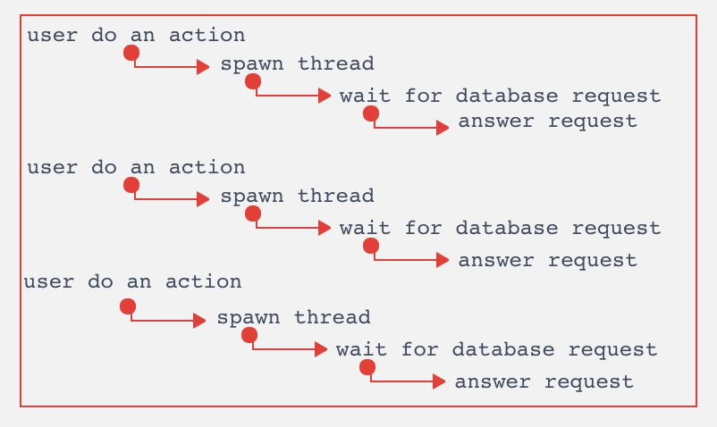
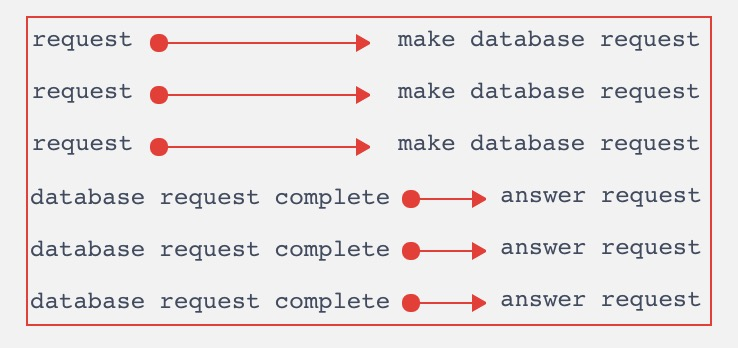

为什么单线程的Node.js 比其他多线程的Web Application 快呢

## 实际的Web服务工作模式
* 后端依赖于数据库
* 在等待数据库返回时，0%的cpu使用 

## 多线程模型
* 为每一个用户请求，申请一个单独的线程来处理
* 线程大部分时间使用0%的CPU等待数据库返回数据
* 必须为每一个线程分配所需的内存(堆、栈)

## 单线程模型(Node.js)
* 每个请求会被丢进Node.js的事件循环中([理解Node.Js事件循环](../event_loop/README.MD))
* 不需要为每一个用户请求，申请一个线程，不需要进行大量的malloc,这样加快了执行效率
* 当数据库(IO)请求返回数据后，事件循环触发响应给客户端

## 总结
* 多线程模型申请线程的成本是很高的
* 申请内存，malloc是很慢的，分配大量的对象意味着会比单线程模型慢
* 如果是CPU密集型的服务，单线程模型会更慢，因为单线程模式，只使用一个CPU内核，CPU密集运算会阻碍整个事件循环的效率

## 参考
[How, in general, does Node.js handle 10,000 concurrent requests?](https://stackoverflow.com/questions/34855352/how-in-general-does-node-js-handle-10-000-concurrent-requests)