一起入门 Graphql 

[toc]

## 介绍

`GraphQL` 既是一种用于 API 的查询语言也是一个满足你数据查询的运行时。如何理解呢？**GraphQL 作为通用的 REST 架构的替代方案而被开发出来**  ,通俗的讲，在架构中他属于和`REST`处于同一个层次的东西。对于`REST`,`GraphQL`的优势在于：

* REST接口的数据由后端定义，如果返回了前端不期望的数据结构就需要和后端沟通修改或者自己适配；
* `GraphQL`向你的 API 发出一个 GraphQL 请求，客户端就能准确获得你想要的数据，不多不少；
* `GraphQL` 可以通过一次请求就获取你应用所需的所有数据，而` REST API `则需要请求多个URL;
* `GraphQL` 查询的结构和结果非常相似，因此即便不知道服务器的情况，你也能预测查询会返回什么结果。


Facebook 开源了 GraphQL 标准和其 JavaScript 版本的实现。后来主要编程语言也实现了标准。


## Hello World

```javascript
const Koa = require('koa');
const { ApolloServer, gql } = require('apollo-server-koa');

// 定义一个查询
const typeDefs = gql`
  type Query {
    hello: String
  }
`;

// 为上面定义的查询提供数据
const resolvers = {
    Query: {
        hello: () => 'Hello world!',
    },
};

const server = new ApolloServer({ typeDefs, resolvers });

const app = new Koa();
server.applyMiddleware({ app });

app.listen({ port: 4000 }, () =>
    console.log(`🚀 Server ready at http://localhost:4000${server.graphqlPath}`),
);
```
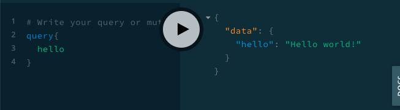

## 标量类型（Scalar Types）

上面例子中，我们给查询定义的返回参数为`String`,GraphQL支持的标量类型还有`String`、`Int`、`Float`、`Boolean` 和 `ID`。

如果类型是一个列表，我们可以这个[Int],表示一个整数的列表，如果是自定义类型也可以这样使用。

同时作为参数的时候，我们可以通过`String!`来表示该参数为必传非空的。


## 指定查询字段

* [案例数据异步Mock数据](#Mock数据)

```javascript
const Koa = require('koa');
const low = require('lowdb');
const FileSync = require('lowdb/adapters/FileSync');

const { ApolloServer, gql } = require('apollo-server-koa');

const adapter = new FileSync('./db/data.json');
const db = low(adapter);

// 定义两个查询方法
const typeDefs = gql`
  type Query {
    hero: Hero
    heroList: [Hero]
  }
  type Hero {
      name: String,
      age: Int
  }
`;

// 为各自的方法提供数据
const resolvers = {
    Query: {
        hero: async (parent, args, context, info) => {
            return db.get('hero').value()[0];
        },
        heroList: async (parent, args, context, info) => {
            return db.get('hero').value();
        },
    },
};

const server = new ApolloServer({ typeDefs, resolvers });

const app = new Koa();
server.applyMiddleware({ app });

app.listen({ port: 4000 }, () =>
    console.log(`🚀 Server ready at http://localhost:4000${server.graphqlPath}`),
);
```
* 简单查询

  如果查询返回的一个对象的时候，你需要为查询执行需要返回的字段，只会返回指定的字段

  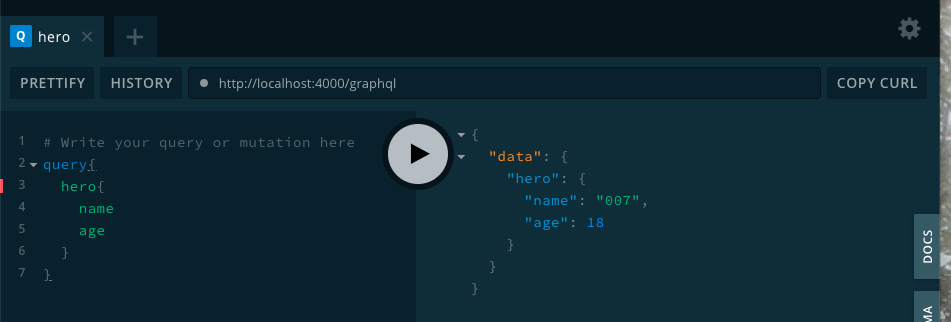

* 只需要 hero 的 name 属性
  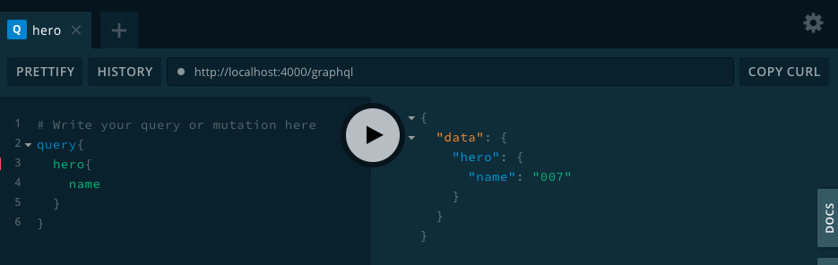

* 一次请求，可以同时进行多次查询，比如同时查询 hero 和 heroList 列表

  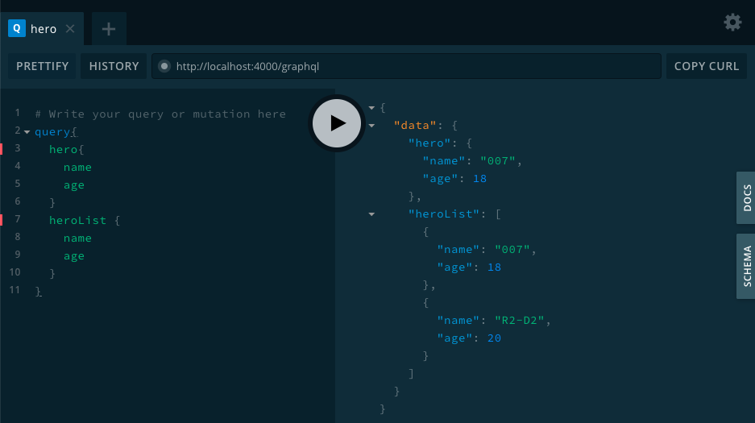


## 参数（Arguments）

类似 REST API ，Graphql也支持给每一个查询添加查询参数，我们只需要做如下修改：

```javascript
...
const typeDefs = gql`
  type Query {
    hero(id :Int): Hero
  }
`;

// Provide resolver functions for your schema fields
const resolvers = {
    Query: {
        hero: async (parent, args, context, info) => {
            const { id } = args;
            return db.get('hero').find({ id }).value();
        }
    },
};
...
```

下面演示了查询结果：我们通过不同的查询ID，查询出来不同的 `hreo`:

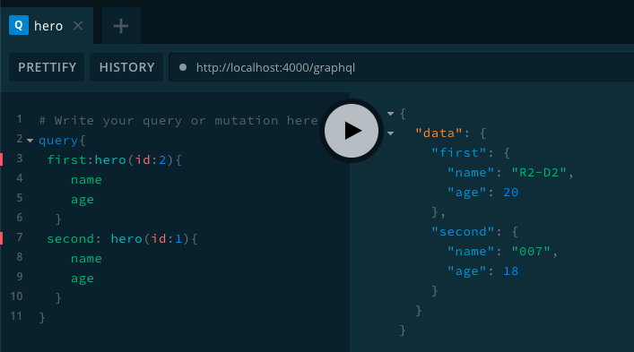

细心的你会发现一个细节，返回的字段名为`first`,`second`。这里我使用了`别名`的方式，因为两个`hero`字段相同，所以存在冲突，我们使用别名来进行区分。


## 别名（Aliases）

通过上图，又接触了一个新的概念 `别名`。主要作用是使得返回字段使用另外一个名字，避免对相同方法不同参数下返回数据冲突的问题（如上）。只要在字段前面使用 `别名:`就可以把返回数据的`key`自动替换为该名称。 


## 片段（Fragments）

如果你追求严谨的代码规范和工程能力，你肯会对 `first`、`second`中两处冗余同样的 `name`、`age`感到难受。一旦以后需需要增减或者修改字段的时候，需要多出地方，容易造成bug。Graphql 为已经考虑到这一点，我们可以使用`片段`来优化:

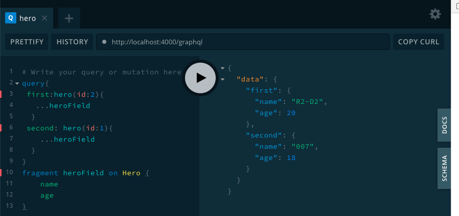

通过片段我们很好的提取了**可服用单元**，然后再需要他们的地方引入。


## 变量（Variables）

我我们现在查询，变量是写在查询字符串中，而实际情况，我们的变量是多态的，每次都去拼接查询字符串不是一明智的方式。Graphql提供了很好的方式来帮我我们来解决这个问题。我们可以定义一个 `变量`

* 使用 `$variableName` 声明一个变量
* 使用 `$variableName：value` 通过变量字典来传输


如上图我们通过**变量** 的方式，解决了变量多态的问题。


## 指令（Directives）

虽然变量帮我们解决了多态的问题，但还是不够完美，比如有一个用户信息列表，我们想针对不同权限的人显示不同的信息。用户收入只允许人力部门查看，用户的学历只允许直属领导查看等，因此我们需要针对不同的权限来过滤。

Graphql核心规范包含两个指令

* `@include(if: Boolean)` 仅在参数为 `true` 时，包含此字段。
* `@skip(if: Boolean)` 如果参数为 `true`，跳过此字段（不查询此字段）。

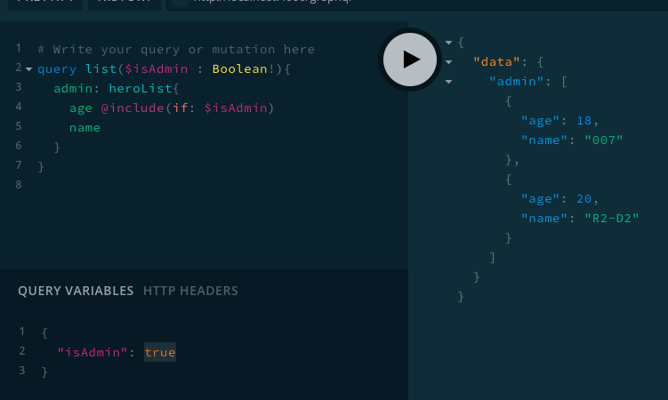

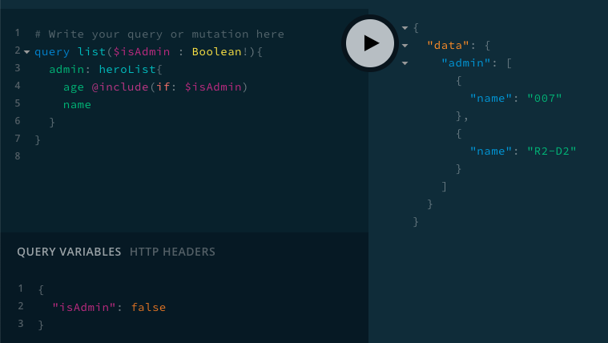

通过以上查询，我们对`isAdmin` 变量赋值`true`和`false`进行了两次查询，从结果可以看到我们控制到了查询字段的展示。


## 变更（Mutations）

如同REST一样，我们不仅需要查询，还需要修改数据：

操作流程如下

1. `typeDefs` 中使用在 `Mutation`块中定义一个 修改的方法
2. resolvers 中使用在`Mutation`块中去实现

```javascript
...
const typeDefs = gql`
    type Mutation {
      createHero(name: String, age: Int): [Hero]
    }
    type Hero {
      id: Int
      name: String,
      age: Int
    }
  `;
  
const resolvers = {
    Mutation: {
      createHero: async (parent, args, context, info) => {
        const model = db.get('hero');
        const len = model.value().length;
        model
          .push({ id: len + 1, ...args })
          .write();
        return db.get('hero').value();
      }
    }
  };
  ...
```

最后我们在 `mutation`中进行操作，如下图：

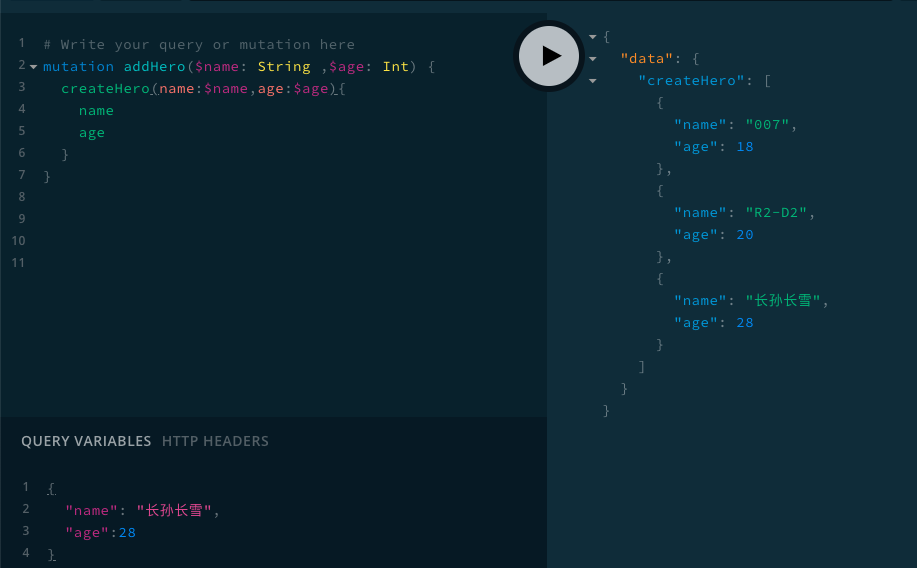

从结果中，我们看到成功的创建了英雄长孙长雪 。注意我们创建英雄后,我们返回了`heroList`。和查询一样，我们也可以同时进行多个变更操作，不一样的是：

**查询是并行执行，而变更操作是线性执行的一个接着一个**。

如下图：

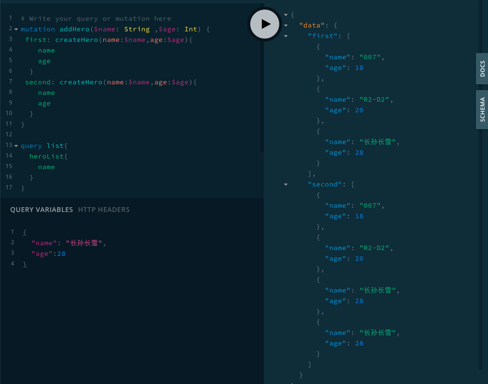

## 输入类型（Input Types

在前面的例子中，我们传入的类型都为标量类型，如果我们想传入一个复杂的结构数据可以使用 `input`关键字。其用法和`type`一样，服务端定义完后，客户端查询的时候也可以使用该类型了。

```javascript
const typeDefs = gql`
    type Query {
      hero(id :Int): Hero
    }

    ## 这里对 AttrInput 类型进行使用
    type Mutation {
      createHero(name: String, age: Int, attr: AttrInput): [Hero]
    }

    ## 这边定义一个 input 参数 ##
    input AttrInput {
      shoes: String
      clothes: String
      hat: String
    }

    type Hero {
      id: Int
      name: String
      age: Int
      attr: Attr
    }
    type Attr {
      shoes: String
      clothes: String
      hat: String
    }
  `;

```

然后我们进行一个 变更操作:

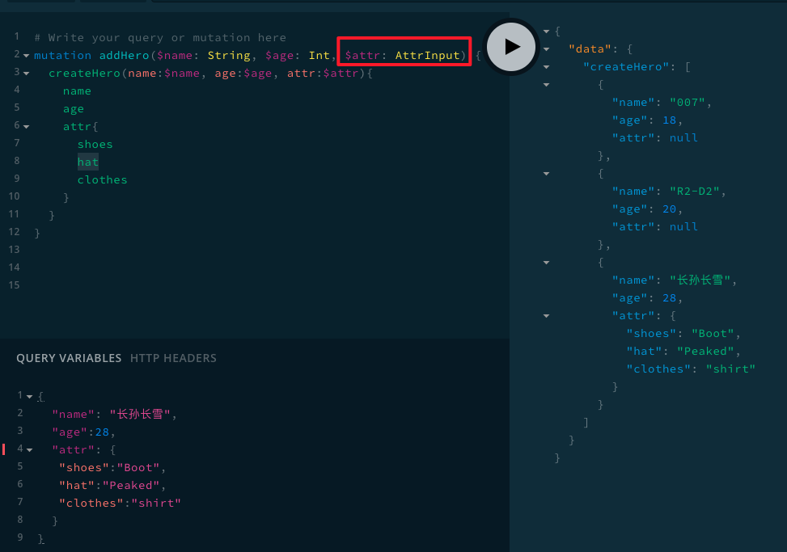

根据定义我们的 attr 参数为:

```
"attr": {
   "shoes":"Boot",
   "hat":"Peaked",
   "clothes":"shirt"
  }
```

## 对象类型（Object Types）

有时候我们不仅仅希望API返回的只是一个数字或者字符串，我们希望可以返回一个对象，而且是带有行为的对象，GraphQL可以很完美的契合这个需求。我们只需要设置返回值为`对象`。

```javascript
const Koa = require('koa');
const { ApolloServer, gql } = require('apollo-server-koa');
// 定义一个查询，并且返回值为一个对象
const typeDefs = gql`
  type Query {
    getDie(numSides: Int): RandomDie
  }
  type RandomDie {
    numSides: Int!
    rollOnce: Int!
    roll(numRolls: Int!): [Int]
  }
`;
...
// 实现一个 对象
class RandomDie {
    constructor(numSides) {
        this.numSides = numSides;
    }

    rollOnce() {
        return 1 + Math.floor(Math.random() * this.numSides);
    }

    roll({ numRolls }) {
        var output = [];
        for (var i = 0; i < numRolls; i++) {
            output.push(this.rollOnce());
        }
        return output;
    }
}
// 查询实现中，返回该对象的实例
const resolvers = {
    Query: {
        getDie: async (parent, args, context, info) => {
            return new RandomDie(args.numSides || 6);
        }
    }
}

const server = new ApolloServer({ typeDefs, resolvers });
const app = new Koa();

server.applyMiddleware({ app });

app.listen({ port: 4000 }, () =>
    console.log(`🚀 Server ready at http://localhost:4000${server.graphqlPath}`),
);
```

然后我们就可以调用了，而且可以调用对象的行为（对象的方法）：

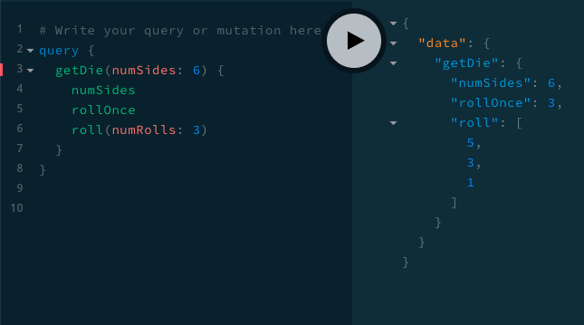

从上图中我们可以看出，我们调用 查询`getDie`,获得对象后，可以直接继续执行对象的行为，这样为后端服务的抽象和复用提供了非常大的帮助。

## 接口（Interfaces)

`GraphQL` 也支持接口，它包含某些字段：

* 对象类型必须包含这些字段，才能算实现了这个接口；

* 因为 `GraphQL` 是强类型的，所以当返回类型为接口的时候，需要 实现`__resolveType`来告诉`GraphQL`返回的具体类型。

```javascript
const Koa = require('koa');
const { ApolloServer, gql } = require('apollo-server-koa');

// 定义一个查询，并且返回值为一个对象
const typeDefs = gql`
    interface Book {
        title: String
        author: String
    }
    type TextBook implements Book {
        title: String
        author: String
        classes: [String]
    }
  
    type Ebook implements Book {
        title: String
        author: String
        format: String
    }
  
    type Query {
        schoolBooks(type: String): [Book]
    }
`;

// 查询实现中，返回该对象的实例
const resolvers = {
    Book: {
        // 当你定义一个查询的返回类型是 union 或者是 interface 的时候，
        // 必须定义这个解析器告诉 graphql 返回的具体类型
        __resolveType(book, context, info) {
            if (book.classes) {
                return 'TextBook';
            }

            if (book.format) {
                return 'Ebook';
            }
            return null;
        },
    },
    Query: {
        schoolBooks: (parent, args) => {
            const { type } = args;
            if (type === 'TextBook') {
                return [{
                    title: '红楼梦', author: '曹雪芹', classes: ['名著', '文学']
                }]
            }

            if (type === 'Ebook') {
                return [{
                    title: '红楼梦', author: '曹雪芹', format: 'pdf'
                }]
            }
        }
    }
}

const server = new ApolloServer({ typeDefs, resolvers });
const app = new Koa();

server.applyMiddleware({ app });

app.listen({ port: 4000 }, () =>
    console.log(`🚀 Server ready at http://localhost:4000${server.graphqlPath}`),
);
```

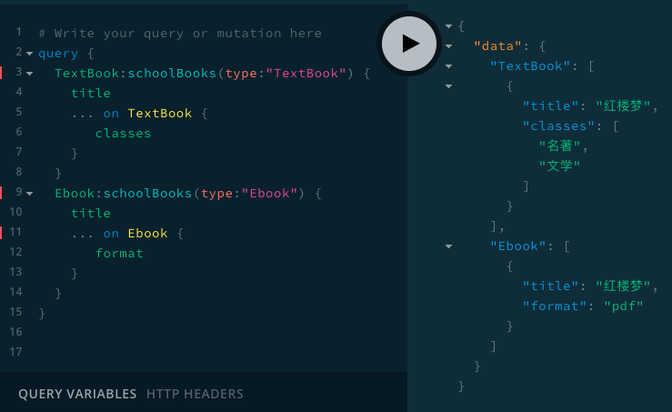

## 内联片段（Inline Fragments

在上图的查询中，`schoolBooks`字段返回`Book`类型，取决于参数返回具体的`TextBook`、`Ebook`。此时如果你需要请求具体类型上的字段就需要使用`内联片段`。标注为：`... on TextBook`,仅在`schoolBooks` 返回`TextBook`类型的时候才会被执行，同理适用于`Ebook`类型。

## 元字段（Meta fields）

继续上面的案例，某些情况下，你并不知道你将从 GraphQL 服务获得什么类型。但是你又需要根据类型来决定如何处理数据，这时候就可以使用`__typename`。

* 允许放在查询的任何位置请求`__typename`

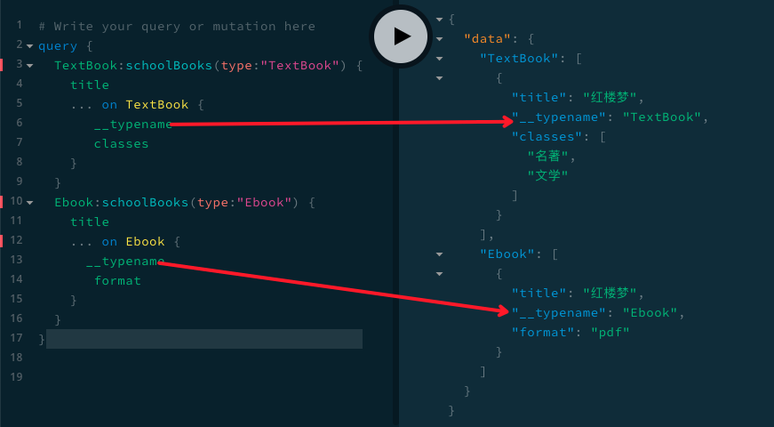

GraphQL 服务提供了不少元字段，剩下的部分用于描述 [内省](https://graphql.cn/learn/introspection/) 系统。

## 联合类型（Union Types） 

联合类型和接口十分相似，但是它并不指定类型之间的任何共同字段。他只的是一个类型可以支持多种不同的类型返回：`union Result = Book | Author`。任何一个返回`Result`的地方都可能得到`Book`或`Author``。

* 联合类型的成员需要是具体对象类型；你不能使用接口或者其他联合类型来创造一个联合类型。
* 查询同样需要使用`条件片段`

```javascript
const Koa = require('koa');
const { ApolloServer, gql } = require('apollo-server-koa');

// 定义一个查询，并且返回值为一个对象
const typeDefs = gql`
  union Result = Book | Author

  type Book {
    title: String
  }

  type Author {
    name: String
  }

  type Query {
    search(type:String): [Result]
  }
`;

// 查询实现中，返回该对象的实例
const resolvers = {
    Result: {
        // 当你定义一个查询的返回类型是 union 或者是 interface 的时候，
        // 必须定义这个解析器告诉 graphql 返回的具体类型
        __resolveType(obj, context, info) {
            if (obj.title) {
                return 'Book';
            }

            if (obj.name) {
                return 'Author';
            }
            return null;
        },
    },
    Query: {
        search: (parent, args) => {
            console.log(args)
            const { type } = args;
            if (type === 'Book') {
                return [{
                    title: '红楼梦'
                }]
            }

            if (type === 'Author') {
                return [{
                    name: '曹雪芹'
                }]
            }
        }
    }
}

const server = new ApolloServer({ typeDefs, resolvers });
const app = new Koa();

server.applyMiddleware({ app });

app.listen({ port: 4000 }, () =>
    console.log(`🚀 Server ready at http://localhost:4000${server.graphqlPath}`),
);
```

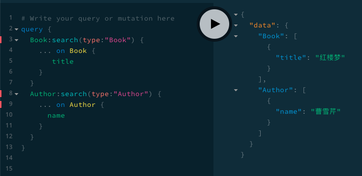

## Mock数据

* 以上案例使用如下的数据进行演示
    * 这`db` 中的数据
* `lowdb` 提供一个本地的数据查询引擎服务

```
{
    "hreo": [
        {
            "id": 1,
            "name": "007",
            "age": 18,
            "family": {
                "mother": "Madhh",
                "father": "Father"
            }
        },
        {
            "id": 2,
            "name": "R2-D2",
            "age": 20,
            "family": {
                "mother": "Madhh",
                "father": "Father"
            }
        }
    ]
}
```

## 参考

[GraphQL 官网](https://graphql.cn/)

[Unions and interfaces](https://www.apollographql.com/docs/apollo-server/schema/unions-interfaces/#interface-type)